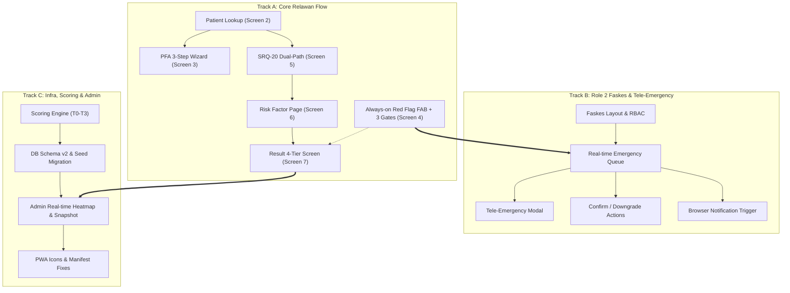

# RAPID-MIND — Implementation Plan (Demo Prototype)

> **Dokumen:** Rencana Eksekusi & Implementasi Prototipe RAPID-MIND  
> **Status:** Siap Eksekusi  
> **Target:** Prototipe berfungsi penuh (*end-to-end*) untuk simulasi demo juri, mencakup alur Relawan, Faskes (PSC 119), dan Admin (BPBD/Dinkes).

---

## 1. Prinsip & Keputusan Desain

Berdasarkan kesepakatan arahan:
1. **SRQ-20:** Menggunakan *dummy data* 20 butir terstruktur dalam file modular (`src/lib/srq20Questions.js`) sehingga dapat diganti instrumen resmi kapan pun tanpa mengubah logika komponen.
2. **Lingkup Demo:** Seluruh fitur wajib berfungsi nyata (*clickable & stateful*), tanpa *dead ends*.
3. **Role 2 (Faskes / PSC 119):** Diimplementasikan dalam versi *simplified* yang realistis:
   - Queue peringatan darurat T0-Suspect *real-time*.
   - Simulasi panggilan Tele-Emergency (UI call modal ke relawan posko).
   - Validasi klinis dua arah: tombol konfirmasi **T0-Confirmed** atau **Downgrade ke T1/T2**.
   - Pelacak status penjemputan ambulans (Tahapan status interaktif).
4. **Notifikasi Darurat:** Menggunakan kombinasi **Firestore `onSnapshot`** (reaktif tanpa refresh) + **Browser Notification API & Audio Chime** untuk sensasi notifikasi instan tanpa ketergantungan Cloud Functions/FCM berbayar.
5. **Migrasi Data & Skema:** Memperbarui skema IndexedDB Dexie ke v2 dan menyesuaikan `src/lib/seed.js` agar menghasilkan data kasus berformat 4-tier (T0, T1, T2, T3) lengkap dengan ID pasien/NIK.

---

## 2. Arsitektur Data & Model Skema

### A. IndexedDB (`RapidMindDB` v2) & Firestore Collections

```
IndexedDB (Dexie v2) & Firestore:
├── users
│   └── { uid, email, name, role ("relawan" | "nakes" | "admin"), poskoName, poskoLat, poskoLng, phone }
│
├── patients
│   └── { nik, nama, usia, jenisKelamin, poskoName, registeredAt, lastPhase ("akut" | "lanjutan"), pfaCompleted: boolean }
│
├── cases (Longitudinal Screening Records)
│   └── { id/localId, nik, nama, relawanId, relawanName, poskoName, timestamp, phase ("akut" | "lanjutan"),
│         method ("verbal" | "nonverbal"), srq20Score, riskFactorScore,
│         tier ("T0" | "T1" | "T2" | "T3"), answers, riskFactors, synced }
│
└── emergencies (T0 Critical Queue)
    └── { id, caseId, nik, nama, relawanId, relawanName, poskoName, lat, lng,
          gates: [gate1, gate2, gate3], status ("T0-Suspect" | "T0-Confirmed" | "Downgraded"),
          downgradedTo: ("T1" | "T2" | null), ambulanceStatus ("Menuju Lokasi" | "Tiba di Posko" | "Selesai"),
          createdAt, confirmedAt }
```

---

## 3. Rencana Kerja Bertahap (3 Track Paralel)



---

### Track A: Alur Utama Relawan (Mobile PWA)

#### 1. Identitas Penyintas & Auto-Lookup (`PatientLookupPage.jsx` — Screen 2)
- Input NIK (16 digit) dengan validasi format.
- Input data pelengkap: Nama Lengkap, Usia, Jenis Kelamin, Posko.
- Fitur simulasi cepat: Tombol *"Pilih Pasien Contoh (Baru / Lama)"* untuk kemudahan demo.
- Logika Auto-Lookup:
  - **NIK Baru:** Sistem otomatis mendeteksi ketiadaan riwayat rekam medis dan mengarahkan relawan ke **Menu PFA (Fase Akut: Hari 1–3)**.
  - **NIK Lama / Sudah Terdaftar:** Menampilkan ringkasan riwayat PFA sebelumnya dan mengarahkan langsung ke **Wawancara SRQ-20 (Fase Lanjutan: Hari 4–30)**.

#### 2. Wizard PFA Interaktif 3 Langkah (`PfaPage.jsx` — Screen 3)
- Antarmuka bertahap (*Stepped Wizard*):
  - **Langkah 1 (LOOK):** Checklist observasi keselamatan fisik, tanda syok akut, luka luar.
  - **Langkah 2 (LISTEN):** Panduan dialog empati, validasi emosi, mendengarkan aktif.
  - **Langkah 3 (LINK):** Checklist pemenuhan kebutuhan esensial (air, makanan, obat, pencarian keluarga).
- Menyimpan status pemenuhan PFA ke database pasien.

#### 3. Persistent Red Flag FAB & 3 Verification Gate (`RedFlagFAB.jsx` + Screen 4)
- Komponen *Floating Action Button* merah berkedip (*pulsing*) yang dipasang di `RelawanLayout.jsx` sehingga **selalu tampil** di seluruh halaman relawan.
- Modal **3 Verification Gate**:
  1. `[ ]` Terdeteksi ideasi bunuh diri atau ancaman menyakiti diri.
  2. `[ ]` Mengalami psikosis akut, halusinasi, atau agitasi destruktif.
  3. `[ ]` Kegawatdaruratan medis fisik akut (kejang, penurunan kesadaran).
- Verifikasi minimal 1 centang sebelum sinyal darurat terkirim.
- Mengunci lokasi GPS posko dan menerbitkan status `T0-Suspect` ke koleksi darurat faskes.

#### 4. Wawancara SRQ-20 Dual-Path (`Srq20Page.jsx` — Screen 5)
- 20 butir pertanyaan terstruktur dari `src/lib/srq20Questions.js`.
- **Toggle Jalur:** Verbal (Speech-to-Text) vs Non-Verbal (Tanya Jawab Manual).
- Pada jalur verbal: integrasi rekaman suara / input teks yang otomatis menandai centang (*auto-checklist*) butir yang relevan dengan **kontrol penuh relawan untuk override/koreksi manual**.
- Tooltip edukasi per butir untuk memandu relawan mengajukan pertanyaan dengan benar.
- Indikator skor dinamis di bagian atas layar.

#### 5. Evaluasi Faktor Risiko & Keberfungsian Hidup (`RiskFactorPage.jsx` — Screen 6)
- Checklist 6–8 indikator keberfungsian harian (pola tidur, makan, disorientasi aktivitas, kehilangan anggota keluarga inti).
- Memberikan bobot tambahan pada klasifikasi klinis akhir.

#### 6. Hasil Triase 4-Tier Terpadu (`ResultPage.jsx` — Screen 7)
- Menampilkan klasifikasi standar bencana:
  - 🚨 **T0 (Emergency):** Rujukan Darurat Psikiatri/PSC 119 segera.
  - 🔴 **T1 (High Risk, Skor SRQ-20 ≥ 11):** Rujukan Konseling Spesialis/Psikolog Klinis.
  - 🟡 **T2 (Moderate Risk, Skor SRQ-20 6–10):** Pendampingan PFA Berkelanjutan / Resilience Coach.
  - 🟢 **T3 (Low Risk, Skor SRQ-20 0–5):** Psikoedukasi Komunitas & Stabilisasi Mandiri.
- Tombol simpan yang terintegrasi dengan IndexedDB dan sinkronisasi Firestore.

---

### Track B: Dashboard Faskes & Tele-Emergency (Role 2)

#### 1. Rute & Tata Letak Faskes (`FaskesLayout.jsx`)
- Header Command Center Unit Faskes / PSC 119 dengan indikator status koneksi dan *live badge counter* untuk kasus T0 aktif.
- Proteksi otorisasi khusus peran `nakes` dan `admin`.

#### 2. Antrean Kasus Darurat Real-Time (`EmergencyQueuePage.jsx`)
- Menggunakan Firestore `onSnapshot` pada koleksi `emergencies`.
- Kartu alert merah berkedip untuk setiap `T0-Suspect` baru yang masuk dari relawan posko.
- Menampilkan: Nama Posko, Nama Penyintas & NIK, Waktu Kejadian, Indikator Gate yang terpicu.

#### 3. Modal Tele-Emergency & Verifikasi Klinis
- Dialog simulasi panggilan suara/video ke relawan di posko terkait.
- Catatan observasi klinis tenaga kesehatan.

#### 4. Eksekusi Validasi Dua Pintu
- **Tombol Konfirmasi (Hijau):** *"Konfirmasi Rujukan (T0-Confirmed)"* → Memicu alokasi unit ambulans dan mengubah status.
- **Tombol Penurunan Status (Kuning):** *"Downgrade Status (ke T1 atau T2)"* → Apabila hasil evaluasi faskes menunjukkan kondisi histeria wajar tanpa risiko fatal.

#### 5. Sistem Suara & Notifikasi Browser
- Notifikasi audio peringatan (Web Audio API synthesiser bip darurat).
- Browser Desktop Notification saat ada panggilan T0 masuk.

---

### Track C: Fondasi Sistem, Scoring, & Dashboard Admin (Role 3)

#### 1. Mesin Skoring Terpadu (`src/lib/scoring.js`)
- Implementasi fungsi `analyzeSrq20(answers)` sesuai ambang batas WHO.
- Implementasi fungsi `calculateFinalTier(srqScore, riskFactors, isRedFlag)` untuk menentukan output T0/T1/T2/T3.
- Perbaikan bug evaluasi checklist (memperhitungkan butir positif dan indikator ketahanan).

#### 2. Migrasi Data Uji Coba (`src/lib/seed.js`)
- Mengisi data simulasi yang memuat:
  - 10 kasus lengkap dengan NIK, nama pasien, dan kategori 4-tier.
  - Kasus darurat T0 aktif untuk demonstrasi faskes.
  - Titik koordinat posko di Jabodetabek.

#### 3. Peningkatan Dashboard Admin (BPBD & Dinkes)
- Integrasi listener data *real-time* (`onSnapshot`) di `DashboardPage.jsx`.
- Indikator banner krisis di bagian atas jika terdapat kasus T0 belum tertangani.
- Pembaruan visual peta di `MapPage.jsx` dengan penanda status posko (Merah berkedip untuk T0, Oranye T1, Kuning T2, Hijau T3).
- Filter data berbasis fase: Fase Akut (Hari 1–3) vs Fase Lanjutan (Hari 4–30).

#### 4. Penyempurnaan Aset PWA & Aksesibilitas
- Penyediaan ikon PWA (`icon-192.png`, `icon-512.png`, `favicon.svg`) di direktori `public/`.
- Penambahan meta-tag PWA lengkap pada `index.html`.
- Registrasi service worker otomatis di `src/main.jsx`.

---

## 4. Daftar Perubahan Berkas

| Status | Lokasi Berkas | Deskripsi Singkat |
|:---:|---|---|
| **[NEW]** | `src/lib/srq20Questions.js` | Definisi 20 butir soal SRQ-20, kata kunci NLP, dan tooltip instruksi |
| **[NEW]** | `src/components/RedFlagFAB.jsx` | Floating Action Button darurat + 3 Verification Gate modal |
| **[NEW]** | `src/pages/relawan/PatientLookupPage.jsx` | Screen 2: Input NIK, auto-lookup data lama vs baru |
| **[NEW]** | `src/pages/relawan/PfaPage.jsx` | Screen 3: Wizard interaktif 3 tahap (LOOK, LISTEN, LINK) |
| **[NEW]** | `src/pages/relawan/Srq20Page.jsx` | Screen 5: Kuesioner SRQ-20 dual-path dengan integrasi STT |
| **[NEW]** | `src/pages/relawan/RiskFactorPage.jsx` | Screen 6: Evaluasi faktor risiko dan keberfungsian harian |
| **[NEW]** | `src/components/layout/FaskesLayout.jsx` | Layout shell untuk Command Center Faskes / PSC 119 |
| **[NEW]** | `src/pages/faskes/EmergencyQueuePage.jsx` | Antrean darurat T0, Tele-Emergency modal, aksi validasi |
| **[MODIFY]** | `src/lib/db.js` | Peningkatan versi skema Dexie v2 (tabel `patients`, `emergencies`) |
| **[MODIFY]** | `src/lib/scoring.js` | Perhitungan kalkulasi 4-tier (T0/T1/T2/T3) dan evaluasi SRQ-20 |
| **[MODIFY]** | `src/lib/seed.js` | Format data demo terbarukan mendukung skema longitudinal dan NIK |
| **[MODIFY]** | `src/contexts/AuthContext.jsx` | Penambahan dukungan role `nakes` dan cache profil lokal |
| **[MODIFY]** | `src/pages/RegisterPage.jsx` | Opsi registrasi role Tenaga Kesehatan (Faskes) |
| **[MODIFY]** | `src/pages/LoginPage.jsx` | Auto-redirect berdasarkan role (`relawan`, `nakes`, `admin`) |
| **[MODIFY]** | `src/components/ProtectedRoute.jsx` | Dukungan multi-role (misal: array `allowedRoles`) |
| **[MODIFY]** | `src/components/layout/RelawanLayout.jsx` | Injeksi komponen global `RedFlagFAB` |
| **[MODIFY]** | `src/pages/relawan/ResultPage.jsx` | Tampilan hasil asesmen 4-tier T0/T1/T2/T3 |
| **[MODIFY]** | `src/pages/admin/DashboardPage.jsx` | Real-time metric card dan banner T0 alert |
| **[MODIFY]** | `src/pages/admin/MapPage.jsx` | Visualisasi pin berkode warna T0–T3 |
| **[MODIFY]** | `src/App.jsx` | Pendaftaran rute baru relawan dan cluster rute faskes |
| **[MODIFY]** | `index.html` & `public/` | Penyediaan meta tag PWA dan aset ikon standar |

---

## 5. Rencana Pengujian & Validasi Demo

### Skenario Uji 1: Alur Pasien Baru (Fase Akut Hari 1–3)
1. Login sebagai Relawan.
2. Masuk ke Triase Baru → Masukkan NIK baru (atau tekan tombol simulasi pasien baru).
3. Sistem mendeteksi NIK belum ada → Diarahkan ke **Menu PFA (Look-Listen-Link)**.
4. Selesaikan checklist PFA → Data tersimpan dan tercatat di riwayat.

### Skenario Uji 2: Alur Pasien Berulang (Fase Lanjutan Hari 4–30)
1. Masukkan NIK penyintas yang sudah memiliki catatan PFA.
2. Sistem menampilkan riwayat PFA sebelumnya → Diarahkan langsung ke **SRQ-20**.
3. Lakukan wawancara verbal menggunakan Speech-to-Text / simulasi kata kunci.
4. Verifikasi bahwa butir pertanyaan tercentang otomatis dan dapat di-override manual.
5. Lanjut ke Penilaian Faktor Risiko → Halaman Hasil menunjukkan tier yang sesuai (T1/T2/T3).

### Skenario Uji 3: Tombol Darurat Red Flag (Two-Tiered Triage Loop)
1. Dari halaman relawan mana pun, tekan tombol melayang **Red Flag Emergency** 🚨.
2. Centang salah satu butir pada modal **3 Verification Gate** → Kirim sinyal T0.
3. Buka jendela kedua dengan akun Tenaga Kesehatan (`/faskes`).
4. Pastikan notifikasi audio berbunyi dan kartu darurat merah berkedip muncul seketika tanpa refresh.
5. Buka modal Tele-Emergency → Tekan tombol *"Konfirmasi Rujukan"* atau *"Downgrade"*.
6. Buka dashboard Admin (`/admin`) → Amati perubahan sebaran risiko pada kartu metrik dan peta.

### Skenario Uji 4: Uji Ketahanan Offline
1. Nonaktifkan koneksi jaringan (mode offline browser).
2. Lakukan pengisian triase hingga selesai.
3. Pastikan data tersimpan di IndexedDB dengan indikator menunggu sinkronisasi.
4. Aktifkan kembali jaringan → Verifikasi proses *background sync* berhasil mengunggah data.
